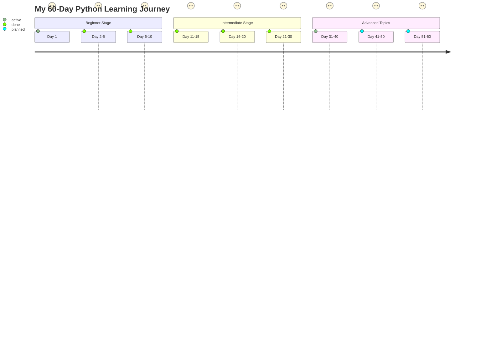

# My-python-learning-journey
# Handwritten Character Recognition


---

<div align="center">
  <h2 style="color: #4CAF50; font-family: 'Arial Black', Gadget, sans-serif;">📜 Overview</h2>
  <p style="color: #555; font-size: 18px;">
    A cutting-edge project using <b>Convolutional Neural Networks (CNN)</b> to recognize handwritten characters efficiently.
    Developed as part of a mini-project for <i>B.Tech in Artificial Intelligence and Machine Learning</i>, this application simplifies optical character recognition with modern machine learning.
  </p>
</div>

---

## 🎯 **Key Features**

🌟 **Dataset:** EMNIST with 800,000+ samples.

🧠 **Algorithm:** CNN with TensorFlow & Keras.

📈 **Accuracy:** Achieved **86.96%** test accuracy.

🧹 **Preprocessing:** Advanced noise reduction and normalization.

💾 **Exportable Models:** Train and save models for reusability.

📊 **Graph Visualizations:** Model accuracy and loss graphs.


---

## 📂 **Project Folder Structure**

```plaintext
📦 Handwritten-Character-Recognition
├── 📁 dataset/               # Raw/preprocessed datasets
├── 📁 models/                # Saved model files
├── 📁 notebooks/             # Training and testing notebooks
├── 📁 results/               # Graphs and predictions
├── 📁 app/                   # Interactive demo app
├── 📄 README.md              # Documentation
└── 📄 LICENSE                # Project license
```

---

## 📊 **Dataset Details**

### EMNIST ByClass Split 📚
- **Training Data:** 697,932 samples
- **Test Data:** 116,323 samples
- **Classes:** 62 (letters + digits)

### Preprocessing Steps:
1. 🖌️ **Normalization:** Convert images to grayscale and scale to [0, 1].
2. 🎛️ **Noise Filtering:** Eliminate artifacts for clean data.
3. ✂️ **Segmentation:** Separate text into distinct characters.

---

## 🛠️ **Technology Stack**

<table>
  <thead>
    <tr>
      <th>📚 Library/Tool</th>
      <th>🔧 Purpose</th>
    </tr>
  </thead>
  <tbody>
    <tr>
      <td><b>Keras</b></td>
      <td>Build and train CNN models</td>
    </tr>
    <tr>
      <td><b>TensorFlow</b></td>
      <td>Machine learning backend</td>
    </tr>
    <tr>
      <td><b>NumPy</b></td>
      <td>Efficient numerical computations</td>
    </tr>
    <tr>
      <td><b>OpenCV</b></td>
      <td>Image preprocessing</td>
    </tr>
    <tr>
      <td><b>Matplotlib</b></td>
      <td>Data visualization</td>
    </tr>
  </tbody>
</table>

---

## 🚀 **Getting Started**

### Prerequisites ⚙️

Install required libraries:
```bash
pip install tensorflow keras numpy matplotlib opencv-python
```

### Running the Project 🖥️
1. Clone the repository:
   ```bash
   git clone https://github.com/username/Handwritten-Character-Recognition.git
   cd Handwritten-Character-Recognition
   ```
2. Open `ModelTrain.ipynb` to train your CNN model.
3. Use `Segment.ipynb` to predict characters from handwritten inputs.

---

## 📈 **Results**

✨ Achieved **86.96%** accuracy.

🏆 Best optimizer: **Adamax** (Accuracy: **89.53%**)


---

## 📜 **Future Enhancements**

1. 🌐 Expand from character recognition to paragraph-level recognition.
2. 💻 Develop a front-end user interface using **HTML**, **CSS**, and **Bootstrap** for intuitive interaction.

---

## 📘 **My Python Learning Journey**

### 🚀 **60-Day Python Roadmap**

Below is an interactive roadmap of my Python learning journey:



### 🏆 **Achievements**

- Completed beginner and intermediate levels with hands-on practice.
- Currently exploring advanced Python libraries and frameworks.
- Built mini-projects like a word counter and calculator.

---

## 🤝 **Contributions Welcome!**

1. Fork this repository.
2. Make improvements or bug fixes.
3. Submit a pull request for review.

---

## 📝 **License**

This project is licensed under the MIT License. See the [LICENSE](LICENSE) file for more details.

---

<div align="center">
  <h3 style="color: #FF5722;">Thank You for Exploring the Project! 🌟</h3>
  
</div>
